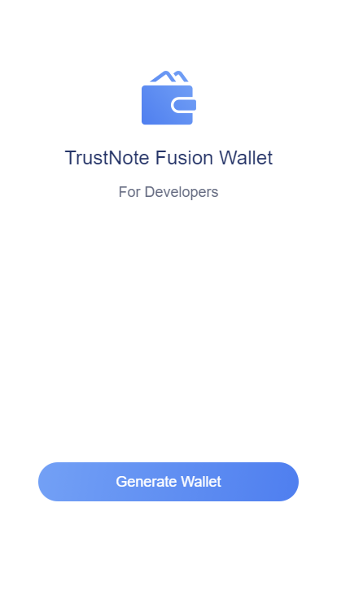
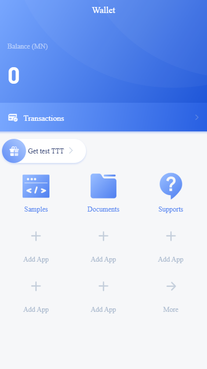
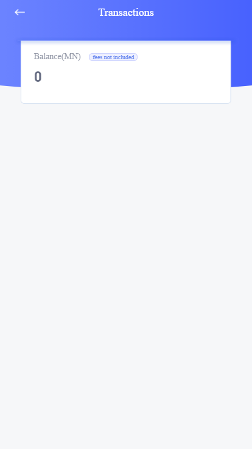
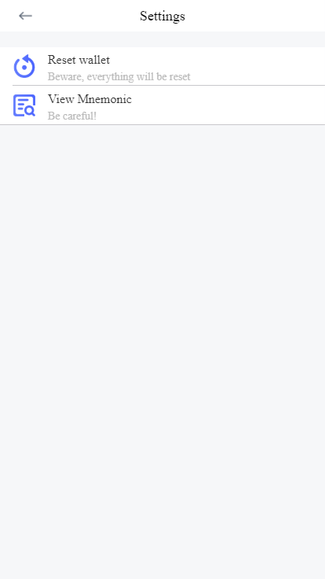

# Content

- [Client Develop](#1)

- [Open Blockchain API](#2)

- [HTML5 APP Develop](#3)

- [Generate Wallet Scheme demo](#4)

<hr />

# <p id="1">Client Develop</p>

Description: The client is responsible for generating mnemonics, private keys, addresses, and persistent storage, which are used to participate in blockchain network trading behavior. Next, we will introduce the open API interface of the blockchain network. The client needs to perform network interaction through the API.

### Native developing：

SDK reference：https://github.com/TrustNoteDevelopers/sdk_android

Document reference：https://github.com/TrustNoteDocs/english_docs/blob/master/sdk/android.md


#### Generate wallet

```java
// initialize SDK
public static void init(Context context)

// generate mnemonics
public static String createMnemonic()

// generate private key
public static String createPrivateKey(String mnemonic)

// generate public key
public static String createWallet(String privkey)

// generate wallet address
public static String createAddress(String walletPubkey)
```

### fusion developing：

code base： https://github.com/trustnote/wallet-base

doc reference： https://github.com/trustnote/wallet-base/blob/master/api/core-API.md


#### Generate wallet

- `npm install wallet-base --save`
- `const Client = require('wallet-base')`

```
const Client = require('wallet-base')

// mnemonic
let mnemonic = Client.mnemonic()

// private key
let privkey = Client.xPrivKey(mnemonic)

// public key
let walletPubkey = Client.walletPubKey(privkey, 0)

// address
let address = Client.walletAddress(walletPubkey, 0, 0)
```

# <p id="2">Open Blockchain API</p>

Testnet Node IP  -  http://150.109.57.242:6002
Mainnet Node IP  -  http://150.109.50.199:6002

## 1. active user wallet

**Description: ** User generates a pair of ecdsa key pairs locally, the private key is kept by itself, and the public key is submitted to the server.
The device generates a unique TrustNote wallet address based on the public key.

request interface： /api/v1/account/register

request method：POST

data：

| name     | type   | is necessary | remark     |
| -------- | ------ | --------     | --------   |
| pubkey   | string | yes          | public key |

Example：

```json
{
  "pubkey": "xpub6BwQQwThGkpzP5uLJ8NMXMFLsFt1B7rqNyeNTB3VXGb95eoK1caM5JpmPAMg8vJQf7d86689qwtGeRC4KL4fVTvMtp9u5W8jo5V5GiRNMNo"
}
```

response：

```json
{
  "network": "devnet",
  "errCode": 0,
  "errMsg": "success",
  "data": {
    "address": "ZDKNB2DQJPQR7PKYI37A5M2MTU5SIZ2A"
  }
}
```

## 2. request balance

**Description：** request wallet assets balance，support TTT and TRC-20 Token.

request interface：/api/v1/asset/balance/:address/:asset

request method：GET

request parameters：

    - address
    - asset id

Example：

- request TTT balance

```
/api/v1/asset/balance/YAZTIHFC7JS43HOYKGNAU7A5NULUUG5T/TTT
```

- request TRC-20 token balance

```
// encode asset ID into URL format
/api/v1/asset/balance/YAZTIHFC7JS43HOYKGNAU7A5NULUUG5T/GYh07uIbuy8yEYNZnCsYvd1pq%2Fw6mYeUslJt5uf5fwg%3D
```

response：

| name     | type   | is stable    |
| -------- | ------ | ------------ |
| stable   | number | yes          |
| pending  | number | no           |

```json
{
  "network": "devnet",
  "errCode": 0,
  "errMsg": "success",
  "data": {
    "stable": 25,
    "pending": 80451
  }
}
```

## 3. request tranfer

**Description：** request to transfer asset，server is response to package the unit and send it to the client and wait for sign，support TTT and TRC-20 Token.

request interface：/api/v1/asset/transfer

request method：POST

request data：

| name     | type   | is necessary | remark     |
| -------- | ------ | --------     | ---------- |
| asset    | string | yes          | asset ID   |
| payer    | string | yes          | address for sender |
| message  | string | yes          | message attached   |
| outputs  | array  | yes          | addresses of receiver |

Example：

```json
{
  "asset": "TTT",
  "payer": "ZDKNB2DQJPQR7PKYI37A5M2MTU5SIZ2A",
  "message": "hello world",
  "outputs": [
    {
      "address": "FYQXBPQWBPXWMJGCHWJ52AK2QMEOICR5",
      "amount": 5
    }
  ]
}
```

response：

| name        | type   | remark     |
| ----------- | ------ | ---------- |
| b64_to_sign | string | hash       |
| txid        | string | transaction ID |

```
{
    network": "devnet",
    "errCode": 0,
    "errMsg": "success",
    "data": {
        "b64_to_sign": "iQjSol75QjDLtzapgxZBWPMgxJnRj2IoOO6pt41eBW8=",
        "txid": "XQ/8hrHpYgtVZxAHSdScUaQGjyVaKwsv52q2qmqLtQE="
    }
}
```

## 4. sign the Unit

**Description：** Submit signature to complete the transfer transaction

request interface：/api/v1/asset/sign

request method：POST

request data：

| name     | type   | is necessary | remark     |
| -------- | ------ | --------     | -------    |
| txid     | string | yes          | transaction ID |
| sig      | string | yes          | signature      |

> #### signature processing：

- Native developing guide

```
/**
 * @method  sign unit hash with pri-key
 * @param
 * @return  signature
 */
public static String sign(String priKey, String unitHash)
```

- Fusion developing guide

```
const Client = require('wallet-base')

// unit wating to sign
// private key
// path
// result
let sig = Client.sign(b64_to_sign, privkey, "m/44'/0'/0'/0/0")
```

Example：

```json
{
  "txid": "BWEGp9t1yKEttWrLkshn7b3brWMy/tHMdyisLFL/3ck=",
  "sig": "li4xPfMMbiMyw7YWGuiHjklWu6IPxQOnlB9S0rjlUkAplCyP5OrlfcjOWOuRO4Ua99cgCTI23wI6rg0outpUwA=="
}
```

response：

| name     | type   | remark     |
| -------- | ------ | ------------- |
| unit     | string | tx unit  hash |

```
{
  "network": "devnet",
  "errCode": 0,
  "errMsg": "success",
  "data": {
    "version": "1.0",
    "alt": "1",
    "messages": [
      {
        "app": "text",
        "payload_location": "inline",
        "payload_hash": "gC2EKFPWD6yh7/5opSCOoBU7p0dVrfIawrvx7G+m6PA=",
        "payload": "hello"
      },
      {
        "app": "payment",
        "payload_location": "inline",
        "payload_hash": "PR1YY8CzI194rIacz5v7WXspoHeBApUNktm7fAb8KgI=",
        "payload": {
          "outputs": [
            {
              "address": "KPQ3CRPBG5FSKVEH6Y76ETGD5D2N7QZ7",
              "amount": 123
            },
            {
              "address": "ZR5Y4RNILLXNGTHIVPSSVMM32NYEFFCQ",
              "amount": 9997108
            }
          ],
          "inputs": [
            {
              "unit": "uujm67ROYdYE06+3Cwrsg/8je8YRrhLCJaBdDK0MFgU=",
              "message_index": 1,
              "output_index": 1
            }
          ]
        }
      }
    ],
    "authors": [
      {
        "address": "ZR5Y4RNILLXNGTHIVPSSVMM32NYEFFCQ",
        "authentifiers": {
          "r": "li4xPfMMbiMyw7YWGuiHjklWu6IPxQOnlB9S0rjlUkAplCyP5OrlfcjOWOuRO4Ua99cgCTI23wI6rg0outpUwA=="
        }
      }
    ],
    "parent_units": [
      "YKvqGN0BPSGU7V1OyZQ3CngT0F1h9625t1w5+PHaRZA="
    ],
    "last_ball": "42oBobq5QeGixWyPyzgGo20Yidz8rBbu3aP9PejN1OU=",
    "last_ball_unit": "TVrwV2a2ikajPkg8e40QjIjViqIhqN2cL/PArZKtpRY=",
    "witness_list_unit": "MtzrZeOHHjqVZheuLylf0DX7zhp10nBsQX5e/+cA3PQ=",
    "headers_commission": 344,
    "payload_commission": 256,
    "unit": "7GC0ZBUf72SH07YXCLTrhpebdx9umNSFhYD3RXPMl0Y=",
    "timestamp": 1541645181
  }
}
```

## 5. get transaction history

**Description：** get address transaction histories，support TTT and TRC Token, and support paging query.

request interface：/api/v1/asset/txhistory/:address/:asset/:page/:itemsPerPage

request method：GET

request data：

    - address
    - asset ID
    - page ID
    - itemsPerPage

Example：

- request TTT history

```
/api/v1/asset/txhistory/QSOMNL7YPFQCYDKFUO63Y7RBLXDRDVJX/TTT/1/10
```

- request TRC-20 token history

```
// encode asset ID into URL format
/api/v1/asset/txhistory/QSOMNL7YPFQCYDKFUO63Y7RBLXDRDVJX/GYh07uIbuy8yEYNZnCsYvd1pq%2Fw6mYeUslJt5uf5fwg%3D/1/10
```

response：

| name     | type  | remark     |
| -------- | ----- | ------------ |
| history  | array | tx histories |

```
{
  "network": "devnet",
  "errCode": 0,
  "errMsg": "success",
  "data": {
    "history": [
      {
        "version": "1.0",
        "alt": "1",
        "messages": [
          {
            "app": "text",
            "payload_location": "inline",
            "payload_hash": "gC2EKFPWD6yh7/5opSCOoBU7p0dVrfIawrvx7G+m6PA=",
            "payload": "hello"
          },
          {
            "app": "payment",
            "payload_location": "inline",
            "payload_hash": "PR1YY8CzI194rIacz5v7WXspoHeBApUNktm7fAb8KgI=",
            "payload": {
              "outputs": [
                {
                  "address": "KPQ3CRPBG5FSKVEH6Y76ETGD5D2N7QZ7",
                  "amount": 123
                },
                {
                  "address": "ZR5Y4RNILLXNGTHIVPSSVMM32NYEFFCQ",
                  "amount": 9997108
                }
              ],
              "inputs": [
                {
                  "unit": "uujm67ROYdYE06+3Cwrsg/8je8YRrhLCJaBdDK0MFgU=",
                  "message_index": 1,
                  "output_index": 1
                }
              ]
            }
          }
        ],
        "authors": [
          {
            "address": "ZR5Y4RNILLXNGTHIVPSSVMM32NYEFFCQ",
            "authentifiers": {
              "r": "li4xPfMMbiMyw7YWGuiHjklWu6IPxQOnlB9S0rjlUkAplCyP5OrlfcjOWOuRO4Ua99cgCTI23wI6rg0outpUwA=="
            }
          }
        ],
        "parent_units": ["YKvqGN0BPSGU7V1OyZQ3CngT0F1h9625t1w5+PHaRZA="],
        "last_ball": "42oBobq5QeGixWyPyzgGo20Yidz8rBbu3aP9PejN1OU=",
        "last_ball_unit": "TVrwV2a2ikajPkg8e40QjIjViqIhqN2cL/PArZKtpRY=",
        "witness_list_unit": "MtzrZeOHHjqVZheuLylf0DX7zhp10nBsQX5e/+cA3PQ=",
        "headers_commission": 344,
        "payload_commission": 256,
        "unit": "7GC0ZBUf72SH07YXCLTrhpebdx9umNSFhYD3RXPMl0Y=",
        "timestamp": 1541645181
      },
      {...}
    ]
  }
}

```

## 6. request transaction detail

**Description：** request single transaction detail

request interface：/api/v1/asset/txinfo/:unitHash

request method：GET

request data：

    - unitHash：        transaction Unit has，encode into URL format

Example：

```
/api/v1/asset/txinfo/F8ofJgi8wokp0uIetxK%2fxwg3aAJ5t7Pvln2MNLGyS8M%3d
```

response：

```
{
  "network": "devnet",
  "errCode": 0,
  "errMsg": "success",
  "data": {
    "unit": {
      "unit": "F8ofJgi8wokp0uIetxK/xwg3aAJ5t7Pvln2MNLGyS8M=",
      "version": "1.0",
      "alt": "1",
      "witness_list_unit": "MtzrZeOHHjqVZheuLylf0DX7zhp10nBsQX5e/+cA3PQ=",
      "last_ball_unit": "FU7+kILFFfH4UK2pIctXWbO6kNliAVP3toei/HHxbiE=",
      "last_ball": "HlVm3tqKy6hWYR3ia/Qat5oNeOxTbxW2siBwhGtdmrc=",
      "headers_commission": 714,
      "payload_commission": 358,
      "main_chain_index": 153960,
      "timestamp": 1539789830,
      "parent_units": ["91IvDcfFy37zKdJ30WXbyUl6/bD2ip1Y6tmBUnK4YW8="],
      "earned_headers_commission_recipients": [
        {
          "address": "OHLL5L5W57IROOH4A3GISUGSP6KMFBRQ",
          "earned_headers_commission_share": 100
        }
      ],
      "authors": [
        {
          "address": "5AOABXFRL5AX3MWEPWKQ6QY3MY6A5TMH",
          "authentifiers": {
            "r": "nC+l/MzXcqsYyHjurBqEUasUz3Eje8TF6XbIuKXZgWw0CsXBF8ORE+0EiHO4PdqGUijDtQ3XNCaa1OFT7I3NpA=="
          }
        },
        {
          "address": "OHLL5L5W57IROOH4A3GISUGSP6KMFBRQ",
          "authentifiers": {
            "r.0.0": "nC+l/MzXcqsYyHjurBqEUasUz3Eje8TF6XbIuKXZgWw0CsXBF8ORE+0EiHO4PdqGUijDtQ3XNCaa1OFT7I3NpA=="
          },
          "definition": [
            "or",
            [
              [
                "and",
                [
                  ["address", "5AOABXFRL5AX3MWEPWKQ6QY3MY6A5TMH"],
                  [
                    "in data feed",
                    [["4VYYR2YO6NV4NTF572AUBEKJLSTM4J4E"], "timestamp", ">", 1531299600000]
                  ]
                ]
              ],
              [
                "and",
                [
                  ["address", "752L4B7Y7WQF3BRFEI2IGIN5RDZE54DM"],
                  ["in data feed", [["4VYYR2YO6NV4NTF572AUBEKJLSTM4J4E"], "timestamp", "=", 0]]
                ]
              ]
            ]
          ]
        }
      ],
      "messages": [
        {
          "app": "payment",
          "payload_hash": "FOfA6SWV/0UVgefXXHMsGk0U4u7lNqo5ewVwZLhNaMc=",
          "payload_location": "inline",
          "payload": {
            "inputs": [
              {
                "unit": "4Cq1KWx1vmXO1L35F6cUj6yXilweVgBn9lCG6d/MLa4=",
                "message_index": 0,
                "output_index": 1
              }
            ],
            "outputs": [
              {
                "address": "OHLL5L5W57IROOH4A3GISUGSP6KMFBRQ",
                "amount": 88928
              }
            ]
          }
        },
        {
          "app": "payment",
          "payload_hash": "grQJshnOKYhYUQCuS1tXEJ7X3schjU5FyGdJ8uvUUy8=",
          "payload_location": "inline",
          "payload": {
            "inputs": [
              {
                "unit": "eap7glIf3PDZ95doA+ngk3vdhFDUhhoQmBn+Cj5SU/A=",
                "message_index": 1,
                "output_index": 0
              }
            ],
            "asset": "7acKn25O/OuxUHJFXFHOACvNWpSDejx/BzxcWsQ8qzY=",
            "outputs": [
              {
                "address": "LVP5X4PB2T757EIWJPACVLACLOOEMAVV",
                "amount": 150
              }
            ]
          }
        }
      ]
    },
    "ball": "ZEHEija1zDNT2Bc52pmmrEZ+Az89lkLAnEpiClUxt94=",
    "skiplist_units": ["KkXI52tTaQSiOz6buEK7i/rJEYuz6rGW7tCGfeqms0M="],
    "arrShareDefinition": [
      {
        "arrDefinition": [
          "or",
          [
            [
              "and",
              [
                ["address", "5AOABXFRL5AX3MWEPWKQ6QY3MY6A5TMH"],
                [
                  "in data feed",
                  [["4VYYR2YO6NV4NTF572AUBEKJLSTM4J4E"], "timestamp", ">", 1531299600000]
                ]
              ]
            ],
            [
              "and",
              [
                ["address", "752L4B7Y7WQF3BRFEI2IGIN5RDZE54DM"],
                ["in data feed", [["4VYYR2YO6NV4NTF572AUBEKJLSTM4J4E"], "timestamp", "=", 0]]
              ]
            ]
          ]
        ]
      }
    ]
  }
}

```

# <p id="3">HTML5 APP developing</p>

Open H5 web pages within the TrustNote app, you can use JSApi and wallet to communicate, JSApi makes it easy for developers' small apps to call the wallet open function in the TrustNote environment.

**Developer needs to introduce trustnote.js into his project**

If the calling interface needs to pass in a callback function, after the wallet has processed the request, 
it will execute the user callback function and return the parameters. The parameter resp format is：

```
{
    eventName: "",
    message: {},
    error: {}
}
```

**eventName:**  name of the event

**message:** response result，null when error 

**error:** error message，null when no error

<hr/>

> ### getAddress

```javascript
function getAddress(callback)
```

**getAddress 参数格式：**

| parameter      | type     | description                |
| -------------- | -------- | -------------------------- |
| callback(resp) | function | callback function          |

**Example：**

```
trustnote.getAddress(function(resp){})
```

**response：**

```
{
    eventName: "address",
    message: {
        address: "IHYT6TOLUDWNX2IV4PLMINTAM5UGVPXW"
    },
    error: null
}
```

<hr/>

> ### callPay

```javascript
function callPay(data, callback)
```

**callPay type：**

| parameter      | type     | description                |
| -------------- | -------- | -------------------------- |
| data           | object   | payment parameter          |
| callback(resp) | function | callback function          |

**data type：**

| key      | type  | description      |
| ------- | ------ | ---------------- |
| payer   | string | payment parameter               |
| outputs | array  | receiver's address and amount   |
| message | string | message attached                |

**outputs type：**

| key     | type   | description      |
| ------- | ------ | --------         |
| address | string | receiver's address |
| amount  | number | amount             |

**Example：**

```
var data = {
    payer: "IHYT6TOLUDWNX2IV4PLMINTAM5UGVPXW",
    outputs: [{
        address: "EKZ2YRGH5GYIGAJ2SOTAVLIBQWSGTYYQ",
        amount: 10
    }],
    message: "hello world"
}

trustnote.callPay(data, function(resp){})
```

**response：**

```
{
    eventName: "payment",
    message: {
        unit: "MulUMgOU4e2ApF0Egq8R4vPt0alrz98y2JCk+gSQYiM="
    },
    error: null
}
```

<hr/>

# <p id="4">Generate wallet demo</p>

##### Create wallet



##### homepage



##### history



##### settings



##### add H5 application


