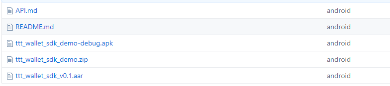
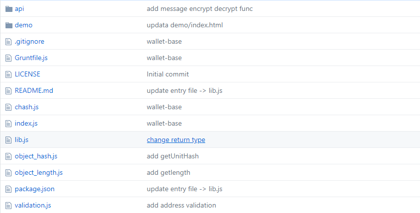
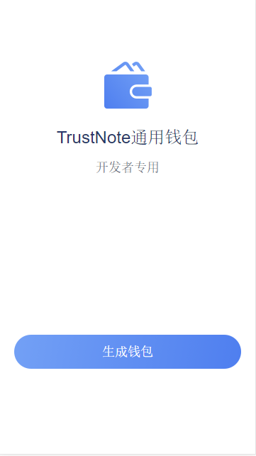
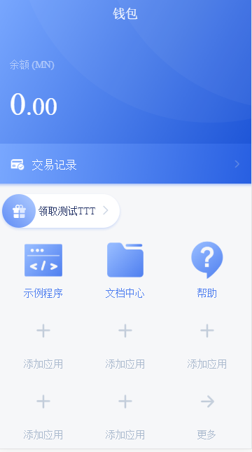
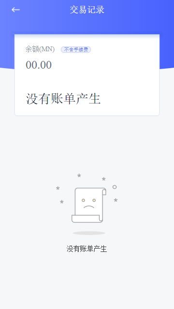
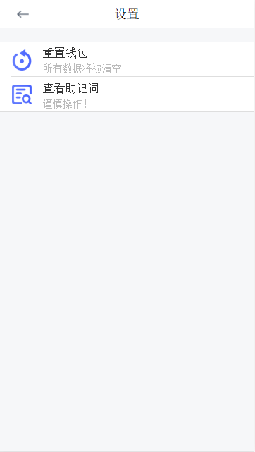
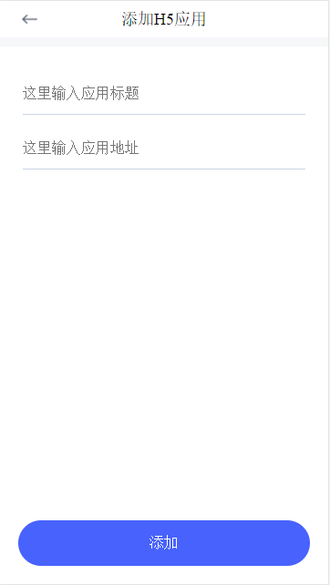

# 目录

- [一. 钱包开发](#1)

- [二. 区块链开放 API](#2)

- [三. H5 应用开发](#3)

- [四. 通用钱包 demo](#4)

<hr />

# <p id="1">一. 钱包开发</p>

描述： 钱包 APP 负责生成助记词、私钥、地址并持久化存储，这些必须条件用来参与区块链网络交易行为。接下来会介绍区块链网络开放 API 接口，APP 需要通过 API 进行网络交互操作。

### Native 开发：

SDK 参考：https://github.com/TrustNoteDevelopers/sdk_android

文档参考：https://github.com/TrustNoteDocs/english_docs/blob/master/sdk/android.md



#### 生成钱包

```java
// 初始化SDK
public static void init(Context context)

// 生成助记词
public static String createMnemonic()

// 生成私钥
public static String createPrivateKey(String mnemonic)

// 生成钱包公钥
public static String createWallet(String privkey)

// 生成钱包地址
public static String createAddress(String walletPubkey)
```

### 混合开发：

代码参考： https://github.com/trustnote/wallet-base

文档参考： https://github.com/trustnote/wallet-base/blob/master/api/core-API.md



#### 生成钱包

- `npm install wallet-base --save`
- `const Client = require('wallet-base')`

```
const Client = require('wallet-base')

// 助记词
let mnemonic = Client.mnemonic()

// 私钥
let privkey = Client.xPrivKey(mnemonic)

// 钱包公钥
let walletPubkey = Client.walletPubKey(privkey, 0)

// 地址
let address = Client.walletAddress(walletPubkey, 0, 0)
```

# <p id="2">二. 区块链开放 API</p>

测试节点 IP 为 http://150.109.57.242:6001

## 1. 用户激活钱包

**描述：** 用户在本地产生一对 ecdsa 密钥对，私钥自己保持，公钥提交到服务器，服务
器根据公钥生成唯一的 TrustNote 钱包地址。

请求接口： /api/v1/account/register

请求方式：POST

提交数据：

| 参数名称 | 类型   | 是否必需 | 说明     |
| -------- | ------ | -------- | -------- |
| pubkey   | string | 是       | 钱包公钥 |

示例：

```json
{
  "pubkey": "xpub6BwQQwThGkpzP5uLJ8NMXMFLsFt1B7rqNyeNTB3VXGb95eoK1caM5JpmPAMg8vJQf7d86689qwtGeRC4KL4fVTvMtp9u5W8jo5V5GiRNMNo"
}
```

响应结果：

```json
{
  "network": "devnet",
  "errCode": 0,
  "errMsg": "success",
  "data": {
    "address": "ZDKNB2DQJPQR7PKYI37A5M2MTU5SIZ2A"
  }
}
```

## 2. 查询余额

**描述：** 查询钱包资产余额，支持查询 TTT 资产和 TRC Token 资产

请求接口：/api/v1/asset/balance/:address/:asset

请求方式：GET

请求参数：

    - address：TrustNote 地址
    - asset：  资产名称

示例：

- 查询地址中 TTT 资产

```
/api/v1/asset/balance/YAZTIHFC7JS43HOYKGNAU7A5NULUUG5T/TTT
```

- 查询地址中 iToken 资产

```
// 需要对资产ID进行URL编码
/api/v1/asset/balance/YAZTIHFC7JS43HOYKGNAU7A5NULUUG5T/GYh07uIbuy8yEYNZnCsYvd1pq%2Fw6mYeUslJt5uf5fwg%3D
```

响应结果：

| 参数名称 | 类型   | 说明         |
| -------- | ------ | ------------ |
| stable   | number | 已经稳定余额 |
| pending  | number | 还为稳定余额 |

```json
{
  "network": "devnet",
  "errCode": 0,
  "errMsg": "success",
  "data": {
    "stable": 25,
    "pending": 80451
  }
}
```

## 3. 请求支付

**描述：** 发起支付请求，节点服务负责打包交易，然后返回待签名信息，支持支付 TTT 资产和 TRC Token 资产

请求接口：/api/v1/asset/transfer

请求方式：POST

提交数据：

| 参数名称 | 类型   | 是否必需 | 说明       |
| -------- | ------ | -------- | ---------- |
| asset    | string | 是       | 资产 ID    |
| payer    | string | 是       | 付款者地址 |
| message  | string | 否       | 附加消息   |
| outputs  | array  | 是       | 收款人列表 |

示例：

```json
{
  "asset": "TTT",
  "payer": "ZDKNB2DQJPQR7PKYI37A5M2MTU5SIZ2A",
  "message": "hello world",
  "outputs": [
    {
      "address": "FYQXBPQWBPXWMJGCHWJ52AK2QMEOICR5",
      "amount": 5
    }
  ]
}
```

响应结果：

| 参数名称    | 类型   | 说明       |
| ----------- | ------ | ---------- |
| b64_to_sign | string | 待签名哈希 |
| txid        | string | 交易 ID    |

```
{
    network": "devnet",
    "errCode": 0,
    "errMsg": "success",
    "data": {
        "b64_to_sign": "iQjSol75QjDLtzapgxZBWPMgxJnRj2IoOO6pt41eBW8=",
        "txid": "XQ/8hrHpYgtVZxAHSdScUaQGjyVaKwsv52q2qmqLtQE="
    }
}
```

## 4. 提交签名

**描述：** 提交已经签名信息，用来完成交易

请求接口：/api/v1/asset/sign

请求方式：POST

提交数据：

| 参数名称 | 类型   | 是否必需 | 说明    |
| -------- | ------ | -------- | ------- |
| txid     | string | 是       | 交易 ID |
| sig      | string | 是       | 签名    |

> #### 签名处理：

- Native 开发参考

```
/**
 * @method  sign unit hash with pri-key
 * @param
 * @return  signature
 */
public static String sign(String priKey, String unitHash)
```

- 混合开发参考

```
const Client = require('wallet-base')

// b64_to_sign 待签名哈希
// 私钥
// 路径
// 返回签名结果
let sig = Client.sign(b64_to_sign, privkey, "m/44'/0'/0'/0/0")
```

示例：

```json
{
  "txid": "BWEGp9t1yKEttWrLkshn7b3brWMy/tHMdyisLFL/3ck=",
  "sig": "li4xPfMMbiMyw7YWGuiHjklWu6IPxQOnlB9S0rjlUkAplCyP5OrlfcjOWOuRO4Ua99cgCTI23wI6rg0outpUwA=="
}
```

响应结果：

| 参数名称 | 类型   | 说明          |
| -------- | ------ | ------------- |
| unit     | string | 交易单元 hash |

```
{
  "network": "devnet",
  "errCode": 0,
  "errMsg": "success",
  "data": {
    "version": "1.0",
    "alt": "1",
    "messages": [
      {
        "app": "text",
        "payload_location": "inline",
        "payload_hash": "gC2EKFPWD6yh7/5opSCOoBU7p0dVrfIawrvx7G+m6PA=",
        "payload": "hello"
      },
      {
        "app": "payment",
        "payload_location": "inline",
        "payload_hash": "PR1YY8CzI194rIacz5v7WXspoHeBApUNktm7fAb8KgI=",
        "payload": {
          "outputs": [
            {
              "address": "KPQ3CRPBG5FSKVEH6Y76ETGD5D2N7QZ7",
              "amount": 123
            },
            {
              "address": "ZR5Y4RNILLXNGTHIVPSSVMM32NYEFFCQ",
              "amount": 9997108
            }
          ],
          "inputs": [
            {
              "unit": "uujm67ROYdYE06+3Cwrsg/8je8YRrhLCJaBdDK0MFgU=",
              "message_index": 1,
              "output_index": 1
            }
          ]
        }
      }
    ],
    "authors": [
      {
        "address": "ZR5Y4RNILLXNGTHIVPSSVMM32NYEFFCQ",
        "authentifiers": {
          "r": "li4xPfMMbiMyw7YWGuiHjklWu6IPxQOnlB9S0rjlUkAplCyP5OrlfcjOWOuRO4Ua99cgCTI23wI6rg0outpUwA=="
        }
      }
    ],
    "parent_units": [
      "YKvqGN0BPSGU7V1OyZQ3CngT0F1h9625t1w5+PHaRZA="
    ],
    "last_ball": "42oBobq5QeGixWyPyzgGo20Yidz8rBbu3aP9PejN1OU=",
    "last_ball_unit": "TVrwV2a2ikajPkg8e40QjIjViqIhqN2cL/PArZKtpRY=",
    "witness_list_unit": "MtzrZeOHHjqVZheuLylf0DX7zhp10nBsQX5e/+cA3PQ=",
    "headers_commission": 344,
    "payload_commission": 256,
    "unit": "7GC0ZBUf72SH07YXCLTrhpebdx9umNSFhYD3RXPMl0Y=",
    "timestamp": 1541645181
  }
}
```

## 5. 获取交易历史

**描述：** 获取钱包交易记录，支持查询 TTT 资产和 TRC Token 资产，支持分页查询

请求接口：/api/v1/asset/txhistory/:address/:asset/:page/:itemsPerPage

请求方式：GET

请求参数：

    - address：         TrustNote 地址
    - asset：           资产名称
    - page：            页码
    - itemsPerPage:     每页显示条目数

示例：

- 查询地址中 TTT 资产历史

```
/api/v1/asset/txhistory/QSOMNL7YPFQCYDKFUO63Y7RBLXDRDVJX/TTT/1/10
```

- 查询地址中 iToken 资产

```
// 需要对资产ID进行URL编码
/api/v1/asset/txhistory/QSOMNL7YPFQCYDKFUO63Y7RBLXDRDVJX/GYh07uIbuy8yEYNZnCsYvd1pq%2Fw6mYeUslJt5uf5fwg%3D/1/10
```

响应结果：

| 参数名称 | 类型  | 说明         |
| -------- | ----- | ------------ |
| history  | array | 交易单元数组 |

```
{
  "network": "devnet",
  "errCode": 0,
  "errMsg": "success",
  "data": {
    "history": [
      {
        "version": "1.0",
        "alt": "1",
        "messages": [
          {
            "app": "text",
            "payload_location": "inline",
            "payload_hash": "gC2EKFPWD6yh7/5opSCOoBU7p0dVrfIawrvx7G+m6PA=",
            "payload": "hello"
          },
          {
            "app": "payment",
            "payload_location": "inline",
            "payload_hash": "PR1YY8CzI194rIacz5v7WXspoHeBApUNktm7fAb8KgI=",
            "payload": {
              "outputs": [
                {
                  "address": "KPQ3CRPBG5FSKVEH6Y76ETGD5D2N7QZ7",
                  "amount": 123
                },
                {
                  "address": "ZR5Y4RNILLXNGTHIVPSSVMM32NYEFFCQ",
                  "amount": 9997108
                }
              ],
              "inputs": [
                {
                  "unit": "uujm67ROYdYE06+3Cwrsg/8je8YRrhLCJaBdDK0MFgU=",
                  "message_index": 1,
                  "output_index": 1
                }
              ]
            }
          }
        ],
        "authors": [
          {
            "address": "ZR5Y4RNILLXNGTHIVPSSVMM32NYEFFCQ",
            "authentifiers": {
              "r": "li4xPfMMbiMyw7YWGuiHjklWu6IPxQOnlB9S0rjlUkAplCyP5OrlfcjOWOuRO4Ua99cgCTI23wI6rg0outpUwA=="
            }
          }
        ],
        "parent_units": ["YKvqGN0BPSGU7V1OyZQ3CngT0F1h9625t1w5+PHaRZA="],
        "last_ball": "42oBobq5QeGixWyPyzgGo20Yidz8rBbu3aP9PejN1OU=",
        "last_ball_unit": "TVrwV2a2ikajPkg8e40QjIjViqIhqN2cL/PArZKtpRY=",
        "witness_list_unit": "MtzrZeOHHjqVZheuLylf0DX7zhp10nBsQX5e/+cA3PQ=",
        "headers_commission": 344,
        "payload_commission": 256,
        "unit": "7GC0ZBUf72SH07YXCLTrhpebdx9umNSFhYD3RXPMl0Y=",
        "timestamp": 1541645181
      },
      {...}
    ]
  }
}

```

## 6. 查询交易详情

**描述：** 查询单个交易详情

请求接口：/api/v1/asset/txinfo/:unitHash

请求方式：GET

请求参数：

    - unitHash：        交易单元哈希，需要URL编码

示例：

```
/api/v1/asset/txinfo/F8ofJgi8wokp0uIetxK%2fxwg3aAJ5t7Pvln2MNLGyS8M%3d
```

响应结果：

```
{
  "network": "devnet",
  "errCode": 0,
  "errMsg": "success",
  "data": {
    "unit": {
      "unit": "F8ofJgi8wokp0uIetxK/xwg3aAJ5t7Pvln2MNLGyS8M=",
      "version": "1.0",
      "alt": "1",
      "witness_list_unit": "MtzrZeOHHjqVZheuLylf0DX7zhp10nBsQX5e/+cA3PQ=",
      "last_ball_unit": "FU7+kILFFfH4UK2pIctXWbO6kNliAVP3toei/HHxbiE=",
      "last_ball": "HlVm3tqKy6hWYR3ia/Qat5oNeOxTbxW2siBwhGtdmrc=",
      "headers_commission": 714,
      "payload_commission": 358,
      "main_chain_index": 153960,
      "timestamp": 1539789830,
      "parent_units": ["91IvDcfFy37zKdJ30WXbyUl6/bD2ip1Y6tmBUnK4YW8="],
      "earned_headers_commission_recipients": [
        {
          "address": "OHLL5L5W57IROOH4A3GISUGSP6KMFBRQ",
          "earned_headers_commission_share": 100
        }
      ],
      "authors": [
        {
          "address": "5AOABXFRL5AX3MWEPWKQ6QY3MY6A5TMH",
          "authentifiers": {
            "r": "nC+l/MzXcqsYyHjurBqEUasUz3Eje8TF6XbIuKXZgWw0CsXBF8ORE+0EiHO4PdqGUijDtQ3XNCaa1OFT7I3NpA=="
          }
        },
        {
          "address": "OHLL5L5W57IROOH4A3GISUGSP6KMFBRQ",
          "authentifiers": {
            "r.0.0": "nC+l/MzXcqsYyHjurBqEUasUz3Eje8TF6XbIuKXZgWw0CsXBF8ORE+0EiHO4PdqGUijDtQ3XNCaa1OFT7I3NpA=="
          },
          "definition": [
            "or",
            [
              [
                "and",
                [
                  ["address", "5AOABXFRL5AX3MWEPWKQ6QY3MY6A5TMH"],
                  [
                    "in data feed",
                    [["4VYYR2YO6NV4NTF572AUBEKJLSTM4J4E"], "timestamp", ">", 1531299600000]
                  ]
                ]
              ],
              [
                "and",
                [
                  ["address", "752L4B7Y7WQF3BRFEI2IGIN5RDZE54DM"],
                  ["in data feed", [["4VYYR2YO6NV4NTF572AUBEKJLSTM4J4E"], "timestamp", "=", 0]]
                ]
              ]
            ]
          ]
        }
      ],
      "messages": [
        {
          "app": "payment",
          "payload_hash": "FOfA6SWV/0UVgefXXHMsGk0U4u7lNqo5ewVwZLhNaMc=",
          "payload_location": "inline",
          "payload": {
            "inputs": [
              {
                "unit": "4Cq1KWx1vmXO1L35F6cUj6yXilweVgBn9lCG6d/MLa4=",
                "message_index": 0,
                "output_index": 1
              }
            ],
            "outputs": [
              {
                "address": "OHLL5L5W57IROOH4A3GISUGSP6KMFBRQ",
                "amount": 88928
              }
            ]
          }
        },
        {
          "app": "payment",
          "payload_hash": "grQJshnOKYhYUQCuS1tXEJ7X3schjU5FyGdJ8uvUUy8=",
          "payload_location": "inline",
          "payload": {
            "inputs": [
              {
                "unit": "eap7glIf3PDZ95doA+ngk3vdhFDUhhoQmBn+Cj5SU/A=",
                "message_index": 1,
                "output_index": 0
              }
            ],
            "asset": "7acKn25O/OuxUHJFXFHOACvNWpSDejx/BzxcWsQ8qzY=",
            "outputs": [
              {
                "address": "LVP5X4PB2T757EIWJPACVLACLOOEMAVV",
                "amount": 150
              }
            ]
          }
        }
      ]
    },
    "ball": "ZEHEija1zDNT2Bc52pmmrEZ+Az89lkLAnEpiClUxt94=",
    "skiplist_units": ["KkXI52tTaQSiOz6buEK7i/rJEYuz6rGW7tCGfeqms0M="],
    "arrShareDefinition": [
      {
        "arrDefinition": [
          "or",
          [
            [
              "and",
              [
                ["address", "5AOABXFRL5AX3MWEPWKQ6QY3MY6A5TMH"],
                [
                  "in data feed",
                  [["4VYYR2YO6NV4NTF572AUBEKJLSTM4J4E"], "timestamp", ">", 1531299600000]
                ]
              ]
            ],
            [
              "and",
              [
                ["address", "752L4B7Y7WQF3BRFEI2IGIN5RDZE54DM"],
                ["in data feed", [["4VYYR2YO6NV4NTF572AUBEKJLSTM4J4E"], "timestamp", "=", 0]]
              ]
            ]
          ]
        ]
      }
    ]
  }
}

```

# <p id="3">三. H5 应用开发</p>

在 TrustNote 应用内打开 H5 网页，可以使用 JSApi 和钱包实现通信，JSApi 方便开发者的小应用在 TrustNote 环境内调用钱包已开放功能

**开发者需要在项目内引入 trustnote.js 文件**

调用接口如果需要传入回调函数，在钱包处理完请求后，会执行用户回调函数并传回参数，参数 resp 格式为：

```
{
    eventName: "",
    message: {},
    error: {}
}
```

**eventName:** 处理事件名称

**message:** 返回内容，错误的时候为 null

**error:** 错误信息，正常情况为 null

<hr/>

> ### getAddress

```javascript
function getAddress(callback)
```

**getAddress 参数格式：**

| 参数           | 类型     | 描述                       |
| -------------- | -------- | -------------------------- |
| callback(resp) | function | 必须是函数，且接受一个参数 |

**示例：**

```
trustnote.getAddress(function(resp){})
```

**返回值：**

```
{
    eventName: "address",
    message: {
        address: "IHYT6TOLUDWNX2IV4PLMINTAM5UGVPXW"
    },
    error: null
}
```

<hr/>

> ### callPay

```javascript
function callPay(data, callback)
```

**callPay 参数格式：**

| 参数           | 类型     | 描述                       |
| -------------- | -------- | -------------------------- |
| data           | object   | 支付参数                   |
| callback(resp) | function | 必须是函数，且接受一个参数 |

**data 类型格式：**

| 键      | 类型   | 描述             |
| ------- | ------ | ---------------- |
| payer   | string | 支付参数         |
| outputs | array  | 收款方地址和金额 |
| message | string | 附加消息         |

**outputs 类型格式：**

| 键      | 类型   | 描述     |
| ------- | ------ | -------- |
| address | string | 收款地址 |
| amount  | number | 收款金额 |

**示例：**

```
var data = {
    payer: "IHYT6TOLUDWNX2IV4PLMINTAM5UGVPXW",
    outputs: [{
        address: "EKZ2YRGH5GYIGAJ2SOTAVLIBQWSGTYYQ",
        amount: 10
    }],
    message: "hello world"
}

trustnote.callPay(data, function(resp){})
```

**返回值：**

```
{
    eventName: "payment",
    message: {
        unit: "MulUMgOU4e2ApF0Egq8R4vPt0alrz98y2JCk+gSQYiM="
    },
    error: null
}
```

<hr/>

# <p id="4">四.通用钱包 demo</p>

##### 创建钱包



##### 主页面



##### 交易历史



##### 设置项



##### 添加 H5 应用


